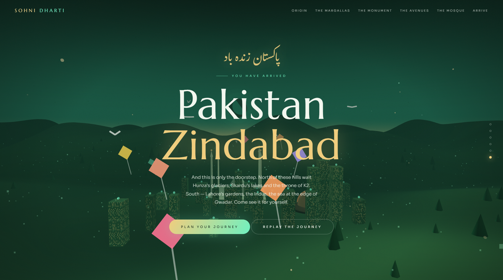

# 🌙 SOHNI DHARTI — Pakistan, Dreamed in Emerald

> **سوہنی دھرتی** — "Beautiful Land"

An immersive 3D experience built to **promote Pakistan** — a cinematic, scroll-driven journey through a dreamlike Islamabad. Instead of reading about the country, you **fly through it**: over the Margalla Hills, around the Pakistan Monument, between the green avenues, and up to the marble minarets of Faisal Mosque — all watched over by a glowing crescent and star.

Built with **Three.js + WebGL**. One single HTML file. No frameworks, no build step.

**[▶ Live Demo](https://ahmadncheema.github.io/Sohni-Dharti/)** <!-- update if your repo name differs -->

 <!-- add a screenshot or GIF named preview.png -->

---

## ✨ The Journey

Scrolling doesn't move a page — it moves a **camera** through six chapters of the capital:

| Chapter | Scene |
|---|---|
| **Origin** | Wide shot — the crescent and star glowing over jade hills |
| **The Margallas** | Camera skims pine-covered slopes of the national park |
| **The Monument** | Circles the four granite petals of the Pakistan Monument on Shakarparian |
| **The Avenues** | Glides through Islamabad's calm, glowing sector skyline |
| **The Mosque** | Rises to Faisal Mosque — the marble tent and its four needle minarets |
| **Arrive** | Pulls back to reveal the whole homeland — *Pakistan Zindabad* |

## 🪁 A Living World

- **The crescent & star** — Pakistan's flag rendered as the moon itself, with layered glow halos
- **7 shaheens** (Iqbal's falcons) circling the hills with animated flapping wings
- **8 basant kites** in festival colors, swaying with trailing tails
- **40 jugnu** (fireflies) blinking and rising into the night
- **110 procedural pines** scattered across the Margalla slopes by altitude
- **Pakistan Monument** with 4 large + 3 small petals and a pulsing golden heart
- **Faisal Mosque** — faceted marble tent, four minarets with beacon tips, warm courtyard glow
- Drifting mist particles, 1,000 stars, and mouse parallax on every frame

## 🎬 Cinematic Techniques

- **Keyframed camera path** — six position/look-at keyframes interpolated with cubic easing
- **Double-smoothed scroll** (scroll → progress → camera) for buttery motion
- **Procedural terrain** — rolling green foothills that rise into a Margalla mountain ridge, vertex-colored from deep pine to misty jade peaks
- **Scroll-synced typography** — oversized Marcellus display type with Urdu accents in the *Gulzar* Nastaliq font
- **Gradient jade-dusk sky shader, exponential fog, film grain + vignette** for the digital-painting look
- **Compass navigation** — dots and nav links fly the camera to any chapter

## 🛠 Tech Stack

- [Three.js r128](https://threejs.org/) — scene, lights, procedural geometry, shaders
- Vanilla **HTML / CSS / JS** — zero dependencies beyond the Three.js CDN
- Google Fonts — *Marcellus* (display), *Gulzar* (Urdu), *Sora* (body)

## 🚀 Run It

```bash
git clone https://github.com/ahmadncheema/Sohni-Dharti.git
cd Sohni-Dharti
# open index.html in any modern browser — that's it
```

**Enable GitHub Pages:** repo → Settings → Pages → Source: `main` branch, root. Because the file is named `index.html`, your demo URL is simply `https://ahmadncheema.github.io/Sohni-Dharti/`.

## ⚙️ Customize

Everything lives in clearly-labeled blocks inside `index.html`:

- **`KEYS` array** — edit camera positions/look-ats to redesign the flight path
- **`hillH()`** — reshape the terrain and the Margalla ridge
- **`data-range="start,end"`** on each `.chapter` — controls when text appears along the scroll
- **`:root` CSS variables** — the emerald/gold/dawn palette
- **Monument / Mosque groups** — swap in other landmarks (Minar-e-Pakistan? Mazar-e-Quaid?) to build journeys for Lahore or Karachi

## ♿ Quality Floor

- `prefers-reduced-motion` respected (animations damped, smooth-scroll disabled)
- Keyboard-focusable navigation with visible focus states
- Pixel ratio capped at 2× for mobile performance
- Responsive down to mobile widths

## 📄 License

MIT — fly free, shaheen.

---

*A sister project to [Miraj](https://github.com/ahmadncheema/Miraj). Same engine of dreams, different homeland. Built as environmental storytelling: replacing brochures with landscapes, and scrolling with travel.* 🇵🇰
